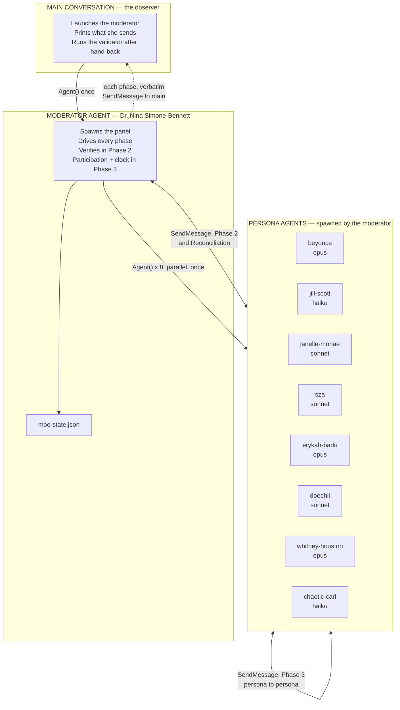
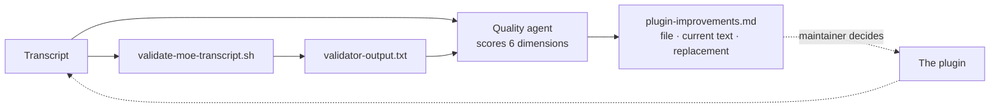

# Architecture

How the plugin is built, how a review executes, and what keeps it honest.

## The parts

Twenty-one files outside `docs/`, and only one of them contains the workflow.

| Path | Role |
|---|---|
| `skills/moe-peer-review/SKILL.md` | The entire workflow. The main session reads its Roles and Launch sections; the moderator agent reads all of it and executes the phases. |
| `agents/moe-moderator.md` | Dr. Nina Simone-Bennett. A spawnable agent with full tool access. |
| `agents/*.md` (8) | Persona system prompts. Spawned by the moderator, read-only, with `SendMessage` for the Huddle. |
| `hooks/hooks.json` | Registers the `SubagentStop` and `PreCompact` hooks. |
| `hooks/scripts/*.sh` (2) | Read-only-violation warning and a compaction reminder. |
| `tests/validate-moe-skill.sh` | Static check on the plugin's own structure. Run by the maintainer. |
| `tests/validate-moe-transcript.sh` | Diagnostic on a produced transcript. Run by the observer after every review. |
| `tests/criteria.md` | Human-readable acceptance criteria. |

Everything the plugin does is prose instructions read by a model. The two shell scripts check the output
afterward; they do not drive it.

## Three roles, and the main session holds only one

This is the most important structural decision, and it is stated at the top of `SKILL.md`.

**The observer** is the main conversation, the session you are talking to. It spawns the moderator with a
fixed launch brief, prints every phase block she sends it, and after she hands back it runs the validator
and spawns the quality-assessment agent. It makes no review decisions. It does not verify claims, seed
threads, nudge panelists, or call time. If you ask it a question mid-review, it answers from what it has
been sent.

**The moderator** is a spawned agent. She builds the packet, spawns the eight personas with the `Agent`
tool, drives every phase, verifies in Phase 2, runs the Huddle's participation check and clock, and
assembles the transcript and state file. She holds full tool access because she needs `Agent` to spawn,
`SendMessage` to resume personas and to reach the main session, `Bash` to run falsification probes, and
`Write` to produce the artifacts. She writes only to the review output directory.

**The panelists** are the eight personas.

The earlier design had the main conversation *be* the moderator, on the grounds that only the main context
can print live. That coupled every review decision to the process the user was talking to. The current
design keeps the live thread by messaging instead of by placement: at the close of every phase the
moderator sends that phase's thread to `main` with `SendMessage`, and the observer prints it verbatim on
arrival.

## Execution model: spawn once, resume twice, then mesh



The eight personas are spawned once, in parallel, during Kick-Off. Phase 2 **resumes** those same agent
IDs with `SendMessage`; a persona resumed by the moderator replies to the moderator, not to the observer.
In Phase 3 the personas message each other directly and the moderator is out of the path until the round
closes; Reconciliation then resumes each persona once more for a final stance. Synthesis resumes no one.
That is what lets Beyonce Carter argue in the Huddle from what she personally said in Phase 1, and what
lets the scoreboard record what she said last rather than what the moderator inferred.

Personas have no `ListAgents`, so they cannot discover each other. The moderator hands out a roster of
agent IDs when the Huddle opens.

## Tool Scope

The moderator has full tool access. The personas hold `Read`, `Glob`, `Grep`, `Bash` and `SendMessage`,
with no `Write` or `Edit`. Their `Bash` is limited by instruction to read-only inspection (`git log`,
`git diff`, `git show`, `grep`, `rg`, `find`, `cat`, `wc`, `ls`), and their `SendMessage` is limited by
instruction to the Huddle. The moderator's `Bash` extends to writing and running throwaway falsification
probes in a scratch directory. `Bash` is never used to modify the material under review; the Review-Only
Guardrail binds it exactly as it binds `Edit` and `Write`.

The moderator generates the git diff and verifies repository sync herself, and refuses to start
Kick-Off until the provenance header matches what her own commands print. The packet also carries two
required verification lines, "Verification performed" and "Not verified", so the method and its blind
spots are stated before any persona has to ask.

## State and compaction recovery

A full review is long enough that context compaction is a realistic mid-run event, for the moderator or
for the observer.

```json
{
  "review_id": "moe-YYYY-MM-DD-NNN",
  "current_phase": "the-huddle",
  "content_summary": "Brief description of what is being reviewed",
  "agents": {
    "beyonce": { "agent_id": "a273fd7c9fbcf30a3", "status": "done", "exchanges": 2 }
  },
  "phases": {
    "kick-off":            { "status": "completed",   "task_id": "1" },
    "interactive-session": { "status": "completed",   "task_id": "2" },
    "the-huddle":          { "status": "in_progress", "task_id": "3" },
    "synthesis":           { "status": "pending",     "task_id": "4" }
  },
  "huddle_exchanges": {},
  "whitney_specialty": "PhD in Data Engineering...",
  "chaotic_carl_backstory": "Six-months-in compliance analyst..."
}
```

The moderator writes this file on every transition. The observer may read it to answer a status question;
the observer never writes it.

If the moderator's context is compacted, she reads the state file, reconciles the task list if one exists,
and resumes from `current_phase` using the stored persona IDs. If the observer's context is compacted, it
reads the state file for the moderator's agent ID and sends her one message asking which phase she is in.
It does not restart the review.

After every phase the moderator re-reads the file and confirms four things: `current_phase` names the
phase about to start, no earlier phase is still pending, agent statuses reflect the phase just finished,
and `huddle_exchanges` is non-empty once the Huddle is done.

## Guardrails

Read-only enforcement is layered, and the layer doing the real work is the least conspicuous.

| Layer | Mechanism | Strength |
|---|---|---|
| Skill preamble | "NEVER apply any recommendation" | Instruction |
| **Persona frontmatter** | **`tools: [Read, Glob, Grep, Bash, SendMessage]`, no Write or Edit** | **Hard restriction on editing tools** |
| Persona body text | "No file modifications." in all eight cards | Reinforcement |
| Observer role | The main session makes no review decisions and touches no project file | Instruction |
| Synthesis `STOP` | Halts before acting on findings | Instruction, validator-checked |
| `SubagentStop` hook | Greps agent output for edit-like language | Advisory warning |

The personas hold read-only `Bash`, so the instruction layers are what keep `Bash` from writing. The
moderator can write anything, so the instruction that she writes only to the review output directory is
what keeps the review advisory.

## Self-validation

After the moderator hands back, the observer runs `tests/validate-moe-transcript.sh` against the
transcript path and prints its output verbatim.

**The validator diagnoses; it does not clean up.** The transcript must never be edited to make a failing
check pass, because the transcript is a faithful record and editing it would hide the very problem the
check reported. On one run the only failure was a persona addressing ChaoticCarl as "Carl" inside her own
quoted message; the transcript was left as written and the failure was traced to the naming rule never
having been delivered to the personas.

What it checks:

| Group | Checks |
|---|---|
| Phase structure | A header for each of the four phases |
| Chat format | Moderator labels, agent-to-agent labels, blockquotes, ASCII arrows |
| Persona names | All eight plus the moderator appear; no bare `Carl` |
| Workflow artifacts | Exchange counts, Huddle participation, Blocker Re-Test Ledger, self-check, Consensus Ledger, Reconciliation with its post-Huddle verification line, eight `Final open items:` stances and the Huddle Consensus Ledger |
| First-person discipline | No third-person narration markers inside blockquotes |
| Synthesis | All ten required section headers |
| Guardrail | The literal string `STOP` |
| State | State file exists and its phase statuses are internally consistent |

These are string greps, not comprehension. The validator cannot tell whether the debate was any good. It
can only tell whether the review left the shape it was supposed to leave.

## The improvement loop



The observer spawns a background agent that receives the transcript **and** the validator output, scores
the run on six dimensions, and classifies every failure as one of two root causes:

- **MODEL EXECUTION**: the guidance was adequate and the model did not follow it. The fix is a sharper,
  harder-to-miss instruction.
- **PLUGIN GUIDANCE**: the plugin never asked, or asked ambiguously. The fix is to say it.

Suggestions are written to `plugin-improvements.md` with the exact file, the current text, and the
proposed replacement. Nothing is applied automatically. The next run begins by checking for that file and
surfacing its recommendations first.

Because the scoring agent sees only the transcript and the validator output, it cannot find defects in the
hooks, the acceptance criteria, or the validators' own logic. Those need a human reading the source.
