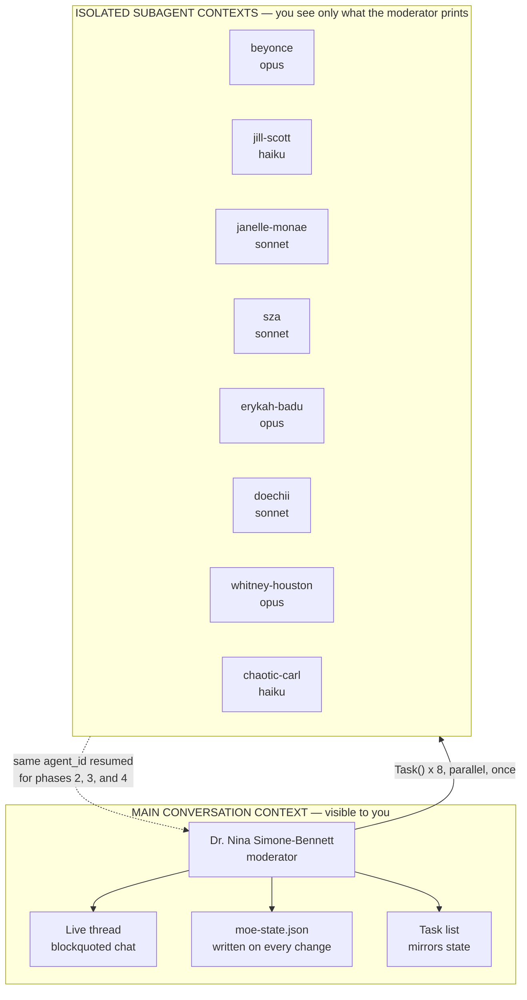
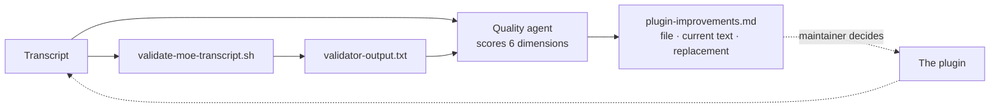

# Architecture

How the plugin is built, how a review executes, and what keeps it honest.

## The parts

Twenty-one files outside `docs/`, and only one of them contains the workflow.

| Path | Lines | Role |
|---|---|---|
| `skills/moe-peer-review/SKILL.md` | 723 | The entire workflow. Loaded into the main conversation; the moderator executes it directly. |
| `agents/*.md` (9) | 53&ndash;83 | Persona system prompts. Eight are spawnable subagents. |
| `agents/moe-moderator.md` | 53 | A reference card, not a spawnable agent. The main context reads it and becomes her. |
| `hooks/hooks.json` | 26 | Registers the `SubagentStop` and `PreCompact` hooks. |
| `hooks/scripts/*.sh` (2) | 13, 36 | Read-only-violation warning and a compaction reminder. |
| `tests/validate-moe-skill.sh` | 315 | Static check on the plugin's own structure. Run by the maintainer. |
| `tests/validate-moe-transcript.sh` | 284 | Diagnostic on a produced transcript. Run by the moderator after every review. |
| `tests/criteria.md` | 101 | Human-readable acceptance criteria. |

Everything the plugin does is prose instructions read by a model. The two shell scripts check the output
afterward; they do not drive it.

## The moderator is not a subagent

This is the most important structural decision, and it is stated explicitly in
`agents/moe-moderator.md`: *"a persona reference card, not a spawnable agent."*

The reason is output visibility. A subagent's internal work is compressed into a final report, and only
its return value reaches you. Because the moderator runs in the main conversation context, every exchange
prints live and you watch the review happen instead of receiving a summary of one that already ended.

She is also the only participant who can write anything. Her declared tools are
`[Read, Grep, Glob, Bash, Write, Edit, Task]`, and the `Write` capability exists solely to produce the
state file and the transcript.

## Execution model: one spawn, three resume phases



The eight personas are spawned once, in parallel, during Kick-Off. Phases 2, 3, and 4 **resume** those
same agent IDs rather than spawning new ones; Synthesis resumes no one, because the moderator aggregates
alone. That is what lets Beyonce Carter argue in the Huddle from what she personally said in Phase 1.

The agent IDs live in `moe-state.json` and are mirrored into task metadata, so either can reconstruct the
run after a compaction.

## Tool Scope

Every participant holds `Bash`, scoped by instruction. The personas' Bash is limited to read-only
inspection (`git log`, `git diff`, `git show`, `grep`, `rg`, `find`, `cat`, `wc`, `ls`); the
moderator's extends to writing and running throwaway falsification probes in a scratch directory.
Bash is never used to modify the material under review; the Review-Only Guardrail binds it exactly as
it binds Edit and Write.

The design consequence of the old "No Bash" rule is gone: the moderator now generates the git diff
and verifies repository sync herself, and refuses to start Kick-Off until the provenance header
matches what her own commands print.

## State and compaction recovery

A full review is long enough that context compaction is a realistic mid-run event. Losing the moderator's
memory partway through would otherwise mean losing eight live agents and four completed phases.

```json
{
  "review_id": "moe-YYYY-MM-DD-NNN",
  "current_phase": "the-huddle",
  "content_summary": "Brief description of what is being reviewed",
  "agents": {
    "beyonce": { "agent_id": "a273fd7c9fbcf30a3", "status": "done", "exchanges": 2 }
  },
  "phases": {
    "kick-off":             { "status": "completed",   "task_id": "1" },
    "clarifying-questions": { "status": "completed",   "task_id": "2" },
    "interactive-session":  { "status": "completed",   "task_id": "3" },
    "the-huddle":           { "status": "in_progress", "task_id": "4" },
    "synthesis":            { "status": "pending",     "task_id": "5" }
  },
  "huddle_exchanges": {},
  "whitney_specialty": "PhD in Data Engineering...",
  "chaotic_carl_backstory": "Six-months-in compliance analyst..."
}
```

Recovery is four steps: read the state file, call `TaskList`, reconcile the two, resume from
`current_phase` using the stored agent IDs.

After every phase the moderator re-reads the file and confirms four things: `current_phase` names the
phase about to start, no earlier phase is still pending, agent statuses reflect the phase just finished,
and `huddle_exchanges` is non-empty once the Huddle is done. That check exists because a real run left the
file claiming Synthesis was complete while Clarifying Questions was still in progress.

## Guardrails

Read-only enforcement is layered five deep, and the layer doing the real work is the least conspicuous.

| Layer | Mechanism | Strength |
|---|---|---|
| Skill preamble | "NEVER apply any recommendation" | Instruction |
| **Agent frontmatter** | **`tools: [Read, Glob, Grep, Bash]`, no Write or Edit** | **Hard restriction on editing tools** |
| Persona body text | "No file modifications." in all eight cards | Reinforcement |
| Synthesis `STOP` | Halts before acting on findings | Instruction, validator-checked |
| `SubagentStop` hook | Greps agent output for edit-like language | Advisory warning |

Layer two is narrower than it once was: the personas have no Write or Edit tool, but they hold
read-only Bash, so the instruction layers are what keep Bash from writing.

## Self-validation

After writing the transcript, the moderator runs `tests/validate-moe-transcript.sh` and prints its output
verbatim.

**The validator diagnoses; it does not clean up.** The skill is explicit that the transcript must never be
edited to make a failing check pass, because the transcript is a faithful record and editing it would hide
the very problem the check reported. An earlier version of this plugin instructed the opposite, and that
instruction was deliberately reversed.

What it checks:

| Group | Checks |
|---|---|
| Phase structure | A header for each of the five phases |
| Chat format | Moderator labels, agent-to-agent labels, blockquotes, ASCII arrows |
| Persona names | All eight plus the moderator appear; no bare `Carl` |
| Workflow artifacts | Exchange counts, Huddle participation, Blocker Re-Test Ledger, self-check, Consensus Ledger |
| First-person discipline | No third-person narration markers inside blockquotes |
| Synthesis | All ten required section headers |
| Guardrail | The literal string `STOP` |
| State | State file exists and its phase statuses are internally consistent |

These are string greps, not comprehension. The validator cannot tell whether the debate was any good. It
can only tell whether the review left the shape it was supposed to leave.

## The improvement loop



A background agent receives the transcript **and** the validator output, scores the run on six
dimensions, and classifies every failure as one of two root causes:

- **MODEL EXECUTION** — the guidance was adequate and the model did not follow it. The fix is a sharper,
  harder-to-miss instruction.
- **PLUGIN GUIDANCE** — the plugin never asked, or asked ambiguously. The fix is to say it.

Suggestions are written to `plugin-improvements.md` with the exact file, the current text, and the
proposed replacement. Nothing is applied automatically. The next run begins by checking for that file and
surfacing its recommendations first.

Because the scoring agent sees only the transcript and the validator output, it cannot find defects in the
hooks, the acceptance criteria, or the validators' own logic. Those need a human reading the source.
