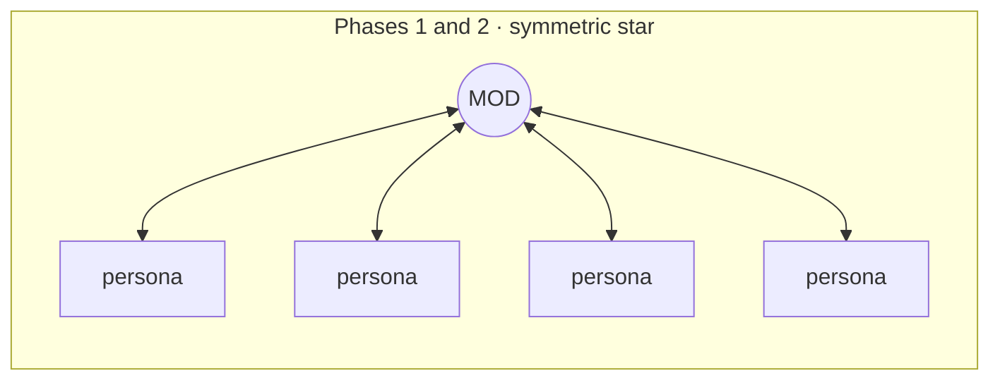
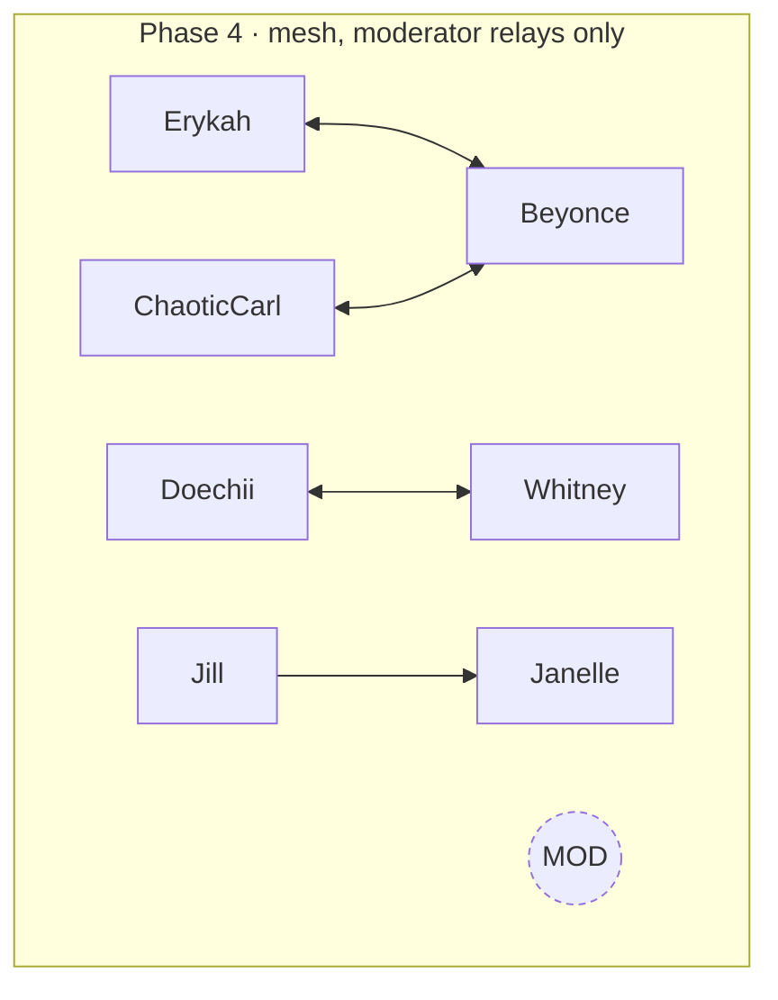
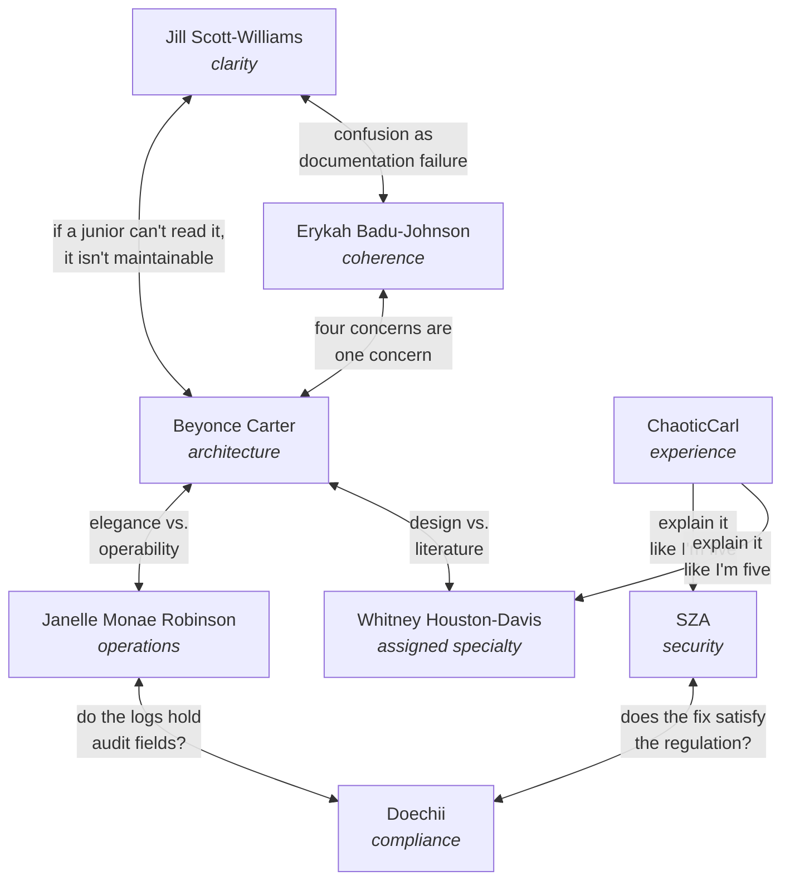

# Conversations

What the panel actually sounds like, and how the talking is shaped.

Every exchange on this page is adapted from a recorded review of a 158 KB pull-request diff that rebuilt
an LLM risk-scoring pipeline. The transcript ran 728 lines and 49 speaking turns. Text is condensed for
length; the substance and the voices are the panel's own.

## Each phase has a different shape

The three shapes below are not stylistic. They are what the workflow structurally produces, and comparing
them is the fastest way to see whether a review went well.

Every persona speaks, the moderator answers every one. Eight turns in, eight replies out.

Same shape, but this is the adversarial round, so the requirement is exact: **2N blocks for N personas.**
A missing reply here is a claim that reached the Synthesis unchallenged.

The moderator says nothing. Experts pair off across domain boundaries.

### Huddle pairings a real run produced

Erykah with Beyonce on a display-layer fix, Doechii with Whitney on data provenance, Jill with Janelle on
observability, and ChaoticCarl with Beyonce on reproducibility. Each pair shares a subject and disagrees
about what matters in it, which is what the moderator selects for when she seeds the round.

---

## Phase 1: the moderator confirms receipt and nothing else

ChaoticCarl arrives with no technical vocabulary and an assigned backstory as a compliance analyst who
runs the tool before vendor sign-off meetings.

> **ChaoticCarl** (End User):
> Category A is still coming back "Unknown" and I can't tell if it's actually fixed. How would I even
> tell the difference between "actually fixed" and "broken again" from the report alone? And why do I
> have to deal with AI behavior at all? The old system was predictable. If I run the same vendor twice
> and get different scores, how do I explain that to Legal?

> **Dr. Nina Simone-Bennett** -> ChaoticCarl:
> Noted. Your first and last points aren't separate complaints, they're the same worry three technical
> reviewers found independently from three different angles. Beyonce found the model call that decides
> your score has no temperature set. Janelle found the test meant to catch that regression is off by
> default in CI. Whitney found a malformed response renders as a clean "Unknown" with no error. You're
> not wrong to not trust it yet. We'll address that.

**What to notice.** She answers nothing substantive, which is the phase rule. What she does instead is
connect a non-technical complaint to three independent technical findings, which is the moderator's real
job: no persona could have made that link, because none of them saw the others' responses.

---

## Phase 3: verify, refuse, or refute

Every factual claim gets one of exactly three responses. Notice that the second reply below is a refusal,
not a confirmation.

> **Beyonce Carter** -> **Dr. Nina Simone-Bennett**:
> **Escalating:** the intake-present branch doesn't just withhold the floor, it actively tells the model
> that a bare "Vendor URL: X" ticket body *is* "what data we will share with the vendor". That pushes
> Category A toward the 0 band, the worst possible direction, not toward Unknown. Final stance: not
> satisfied, 7 open items.

> **Dr. Nina Simone-Bennett** -> Beyonce Carter:
> I verified your escalation directly by re-reading the prompt's static wrapper text, confirmed exactly
> as you describe. I verified your `deletionMechanism` citation against `data-handling-contract.ts`,
> exact match.

> **SZA** -> **Dr. Nina Simone-Bennett**:
> An attacker with read access to the job queue could replay a completed payload and overwrite the
> verdict field. There is no nonce and no idempotency key on that path.

> **Dr. Nina Simone-Bennett** -> SZA:
> I cannot verify this: I read the queue consumer and found no nonce, which matches your structural
> claim. But I could not establish that the verdict field is writable post-completion, since the status
> guard may block it. Carrying as a Warning, not a Blocker, until the call path is confirmed.

**What to notice.** A structurally correct finding was **downgraded** because the harm was not
demonstrated. That is the Blocker Re-Test rule doing its work: confirming a fact is true is not the same
as confirming it causes the claimed damage.

### The self-check

> **Self-check before The Huddle**: did I reject any claim from any agent this round? Yes. I refuted the
> `Number("")` silently becoming 0 sub-claim, since the empty-string path is already guarded before
> `Number()` runs, and I declined to characterize the model's structured-output strictness without citing
> this repo's own required source.

A review where the moderator rejected nothing must say so and explain why. Making the absence of
skepticism visible is more reliable than demanding skepticism.

---

## Phase 4: the exchange that justifies the design

This is the pattern the whole plugin exists to produce. Two specialists propose fixes that look
complementary, and the collision reveals that one would break the other.

> **Doechii** -> **Whitney Houston-Davis**:
> Your fabrication finding is sharper and more urgent than mine, and I'm not contesting it. But they're
> not the same root cause. Yours is fabrication under absence: no data, so the model invents one. Mine is
> trust-calibration on data that *is* present, where a cited legal document and an uncited guess get the
> identical "exact and authoritative" stamp. Your fix doesn't touch a case where a present-but-shakily-
> sourced fact wrongly floors Category A.

> **Whitney Houston-Davis** -> **Doechii**:
> Orthogonal, both must ship, and I can prove it with a second log example: Category B scored 0/20, the
> lowest-risk band, entirely on two known facts quoted verbatim with no grade check, from the same run
> that produced my fabrication finding. Your failure mode understates risk; mine overstates it. A
> pipeline that errs in both directions on the same run is calibrated in neither.
>
> **Critical warning:** if your gate is built as a *filter* that drops sub-threshold facts, it converts
> populated-but-uncertain cells into empty ones, which is indistinguishable from never-measured, making
> my fabrication bug *worse*, not better. Recommend: label, don't filter. A three-state provenance model
> as two fields on one type, not two separate patches.

**What to notice.** Neither persona could have produced this alone. Doechii proposed a fix. Whitney showed
that the fix, implemented the obvious way, would amplify her own separate bug. The output is a third
design that neither had proposed, and it only exists because the two were put in a room.

### ChaoticCarl as a forcing function

> **ChaoticCarl** -> **Beyonce Carter**:
> Explain it like I'm five. What does "temperature zero" actually look like for me? What's the override
> command? And would Monday's score and Wednesday's score match?

> **Beyonce Carter** -> **ChaoticCarl**:
> Temperature zero is one line in a config file, invisible to you, and worth doing. But it does **not**
> guarantee reproducibility, because the deciding step runs a fresh live web search every time regardless
> of the randomness dial. There is no override flag anywhere in the CLI; the real override is the Jira
> status field a human sets by hand. Same vendor Monday and Wednesday: no guarantee of an identical
> number. Nobody has measured how much it moves, which is exactly the missing data point.

**What to notice.** A non-technical demand for plain language forced a senior engineer to trace a claim to
its end, and the trace ended at an unmeasured variable nobody had noticed. ChaoticCarl did not find that.
He caused it to be found.

---

## Cross-persona alignments

Each persona card names who they align with and who they clash with. These are the seams the moderator
seeds along.

The productive pairs share a subject and disagree about what matters in it. SZA and Doechii both care
about protecting data and routinely clash on whether a technical fix satisfies a regulatory requirement.
Jill and ChaoticCarl both care about legibility and arrive from opposite ends of politeness.

---

## Reading a transcript critically

Three questions answer whether a review was rigorous, and all three are checkable by eye:

1. **Does Phase 3 have a moderator reply for every persona?** Count the blocks. Anything short of 2N
   means claims reached the Synthesis unchallenged.
2. **Is there a Blocker Re-Test Ledger with a row per Blocker?** Blockers without a recorded attack were
   confirmed, not verified.
3. **Did the moderator reject anything?** The self-check answers this in her own words. A review where
   nothing was refuted is either unusually clean or insufficiently adversarial, and she is required to say
   which.

`tests/validate-moe-transcript.sh` checks all three mechanically, along with format and naming rules.
