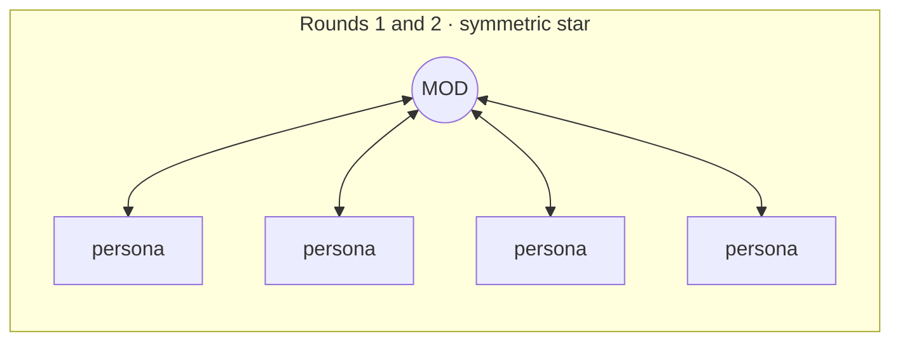
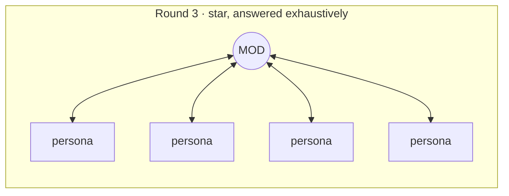
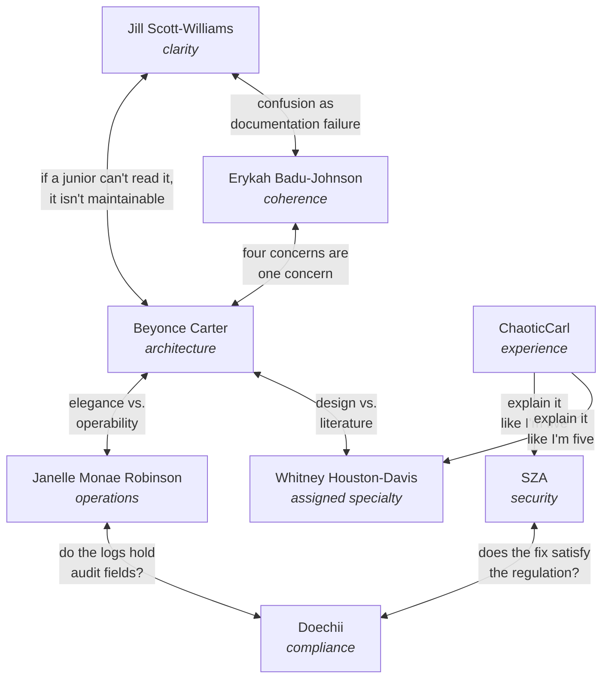

# Conversations

Every turn of a real review, round by round.

This page is a full worked review, **60 turns** across four rounds, with who addressed whom and what each
said. Nothing is skipped.

It documents the **current** workflow: the sequence below is the shape a review is required to produce
today. The findings, the voices, and the technical substance are adapted from recorded reviews of a
pull request that rebuilt an LLM risk-scoring pipeline. Text is condensed for length.

## Turn budget

| Round | Persona turns | Moderator turns | Total |
|---|:--:|:--:|:--:|
| 1 · Kick-Off | 8 | 8 | 16 |
| 2 · Clarifying Questions | 8 | 8 | 16 |
| 3 · Interactive Session | 8 | 8 + 3 closing blocks | 19 |
| 4 · The Huddle | 9 | 0 | 9 |
| **Total** | **33** | **27** | **60** |

Rounds 1, 2 and 3 are symmetric by rule: **2N blocks for N personas.** The Huddle is not, because it
pairs experts rather than polling them, and the moderator only relays.

## Each round has a different shape

The three shapes are not stylistic. They are what the workflow structurally produces, and comparing them
is the fastest way to see whether a review went well.

Every persona speaks, the moderator answers every one.

Same shape, but this is the adversarial round, so the requirement is exact: **2N blocks for N personas.**
A missing reply here is a claim that reached the Synthesis unchallenged.

The moderator says nothing. Experts pair off across domain boundaries.

---

# Round 1: Kick-Off

Sixteen turns. Each persona delivers first impressions; the moderator confirms receipt and answers
nothing. Seven of the eight independently discovered that the diff they were handed did not match the
code on disk.

### 1 · Beyonce Carter

> Lead: the single most important thing on this branch is that band selection is now a non-deterministic
> LLM call with zero automated regression protection, and the diff I was handed does not match the code
> on disk.

Seven findings. **Blocker:** the narrative pass runs on a config that never sets `temperature`, so the
same vendor could score 15 on one run and 25 on the next. **Blocker:** 204 lines of deterministic
band-selection tests were deleted and replaced by a live canary excluded from the normal test glob.
Warnings on 25 of the rubric's 100 points being evidence-unreachable in a default deployment, on `Fail`
being structurally unreachable when Category A is Unknown, and on parsing errors rendering identically to
an API outage.

### 2 · Dr. Nina Simone-Bennett -> Beyonce Carter

> Noted, Beyonce. The stale-packet catch and the temperature finding both go straight to Round 2.

### 3 · Jill Scott-Williams

Seven questions, opening with the packet mismatch she could not explain:

> The context notes say the persona-framing line was removed, but I can see it right there in the diff I
> was given at line 3163. Is the diff stale, or did the fix not land?

Also: she cannot find the schema file, so she cannot confirm the response schema constrains `points` to an
enum rather than asking nicely in prose. `RISK_INTERNAL_SYSTEMS_TO_CHECK` reads backwards to her. The two
model calls are named generically even though the debug output calls them CALL 1 and CALL 2, so a future
refactor could parallelize two calls that are actually sequential and dependent.

### 4 · Dr. Nina Simone-Bennett -> Jill Scott-Williams

> You were right to be suspicious. The diff you were handed was genuinely stale, and several of your
> fellow panelists independently caught the same thing by reading the actual repo. Your instinct to flag
> the inconsistency rather than assume you were wrong is exactly right, and it's going in the transcript
> as a positive example.

### 5 · Janelle Monae Robinson

Seven items from an operational read, cross-checked against both the diff and the working tree.
**Warning:** the failure mode lost its graceful degradation, since the old code computed a partial score
from peer envelopes even when the reasoning call failed, and the new code zeroes all four categories on
any single failure. **Warning:** the regression test for the just-fixed bug is not in CI. **Process
flag:** she caught the stale diff independently via grep and asks which SHA it was generated from. She
closes by asking what the rollback plan is if the live canary starts failing after merge, noting that
right now it is "someone notices a bad report."

### 6 · Dr. Nina Simone-Bennett -> Janelle Monae Robinson

> The lost-partial-credit finding and the CI-gap-on-a-just-fixed-bug finding are both going to be central
> in Round 2. They connect directly to what Beyonce and Whitney found too.

### 7 · SZA

Reviewed both files fully, then grep-verified specific claims rather than trusting the summary. Two
findings are flagged as pending verification because they may be stale-diff artifacts. The one that
survives is hers alone:

> Peer-job answers are labeled "exact and authoritative" to the model, but those facts trace back to
> grounded research over the vendor's own trust-center pages. A vendor with something to hide has a
> direct, labeled-as-authoritative channel into the scoring logic.

She also flags that internal system names are being sent into every Category C prompt with no
data-handling caveat, and credits the response-schema constraint as real defense in depth.

### 8 · Dr. Nina Simone-Bennett -> SZA

> I can already tell you findings one and two are stale-diff artifacts, but we'll re-verify formally in
> Round 2 rather than take my word for it. Your third is a real, still-open finding on the actual code.
> That's going straight into the Interactive Session.

### 9 · Erykah Badu-Johnson

Leads with the packet problem, then delivers the naming collision that shapes the rest of the review:

> Two known facts wear the same "regulatory frameworks" name. One is privacy law only; the other is
> certifications mixed with privacy law. The Category A floor rule fires on "the known facts show a
> privacy regulation" and can't tell which one it's looking at, so a vendor with only SOC 2 and ISO 27001
> could trip a privacy-law floor.

Plus: a vendor product name leaked into a durable capability-name constant, two report fields vanished
with no mention in the PR description, two comma-separated env vars parsed in two different places, and a
schema test that is tautological because it compares `"Unknown"` to `"Unknown"`.

### 10 · Dr. Nina Simone-Bennett -> Erykah Badu-Johnson

> The dual "regulatory frameworks" label collision is a sharp catch, and it's a live ambiguity in the real
> prompt, not a stale-diff artifact.

### 11 · Doechii

The highest-severity finding of the round, and it does not depend on the packet at all:

> Verbatim PII/PHI-shaped data is injected into an external LLM prompt with web search enabled. The raw
> Jira ticket description flows completely unfiltered into a grounded call, and the PR's own live canary
> test uses "We will share employee Social Security numbers and bank account details for payroll
> processing" as its literal fixture, proving this is the expected real-world shape, not a hypothetical.

She cites 45 CFR 164.502(b) and 164.308(b)(1), notes that whether a signed BAA exists determines Blocker
versus documentation gap, and asks three specific questions she wants answered before Round 2.

### 12 · Dr. Nina Simone-Bennett -> Doechii

> Your first finding doesn't depend on line numbers or the stale-diff incident at all. It's true on the
> real branch exactly as you describe it, and it's the single highest-severity finding of this entire
> Kick-Off round.

### 13 · Whitney Houston-Davis

Assigned specialty this run: **PhD in Data Engineering** (stream processing, exactly-once semantics,
schema evolution). She opens with a procedural warning, then applies the lens:

**Blocker:** no referential-integrity test binds the known-fact answer keys to their producing contracts,
so renaming a field upstream would silently break the Category A floor rule while every existing test
stays green. **Blocker:** a malformed structuring response produces four clean `"Unknown"` selections with
no error, rendered identically to "the agent looked and found nothing," when the actual event was a
transform failure. Warnings on three materially different upstream states collapsing into one
indistinguishable output, and on two magic thresholds whose boundary is moot by luck rather than design.

### 14 · Dr. Nina Simone-Bennett -> Whitney Houston-Davis

Confirms receipt and routes the malformed-response finding to Round 2.

### 15 · ChaoticCarl

Assigned backstory this run: a six-months-in compliance analyst who runs the tool before vendor sign-off
meetings, does not read TypeScript, and needs the report to survive Legal.

> Category A is still coming back "Unknown" and I can't tell if it's actually fixed. How would I even tell
> the difference between "actually fixed" and "broken again" from the report alone? What is
> `RISK_INTERNAL_SYSTEMS_TO_CHECK` and why do I have to remember to set it? I'm going to forget it exists,
> run a review, post it, and get questions from Legal I can't answer. And why do I have to deal with AI
> behavior at all? If I run the same vendor twice and get different scores, how do I explain that?

### 16 · Dr. Nina Simone-Bennett -> ChaoticCarl

> Your first and last points aren't separate complaints, they're the same worry three technical reviewers
> found independently from three different angles. Beyonce found the model call that decides your score
> has no temperature set. Janelle found the test meant to catch that regression is off by default in CI.
> Whitney found a malformed response renders as a clean "Unknown" with no error. You're not wrong to not
> trust it yet.

**What Round 1 buys: independence.** No persona sees another's response, so agreement is evidence and
disagreement is coverage. Three things in this round prove it.

- **Seven of the eight independently caught that the diff did not match the code on disk.** No check was
  designed to detect that; redundancy found it. Each of them reached it differently: Beyonce built a
  six-row comparison table, Janelle grepped the working tree, Erykah built a five-row table of her own,
  and Jill simply reported that the notes and the diff disagreed and asked which was wrong.
- **Several converged on the same Category A floor-rule gap from four unrelated lenses**: architecture,
  security, naming, and data engineering. By Round 2 the moderator can tell Beyonce that SZA, Erykah, and
  Whitney found it independently, which is worth far more than any one of them asserting it.
- **Doechii's unfiltered-PHI finding was reachable by exactly one lens.** No other persona's domain would
  have surfaced it, and a single reviewer of any other specialty would have missed it entirely.

The moderator answers nothing substantive, by rule. Her only real work is noticing that ChaoticCarl's two
complaints are the same defect three technical reviewers already found, which she can see and they cannot.

---

# Round 2: Clarifying Questions

Sixteen turns. All eight re-read a corrected content file first. Every question is now against the real
branch state, and every moderator answer is a verification, a refusal, or a correction.

### 17 · Beyonce Carter

Seven questions: is the missing `temperature` a decision or an oversight, and what is the measured band
variance across five runs? Why is one category's split an LLM judgment instead of arithmetic? What
criterion excluded one field from extraction when a similar one was included? Is `Fail` being unreachable
intended? Why does the Category A floor live in prompt text rather than in code, where it could be
unit-tested?

### 18 · Dr. Nina Simone-Bennett -> Beyonce Carter

> Verified each claim directly. Temperature: confirmed absent on grounded, present on structuring, real
> and unmitigated, no five-run sample (costs API spend). Fail-unreachable: confirmed by arithmetic.
> Floor-in-prompt: no engineering justification found; your proposed alternative is sound. **One more fact
> for you:** the floor instruction exists ONLY in the no-intake branch of the prompt ternary. SZA, Erykah,
> and Whitney independently found the same gap.

### 19 · Jill Scott-Williams

Is the floor instruction actually in the prompt, or just tested for as a placeholder? Does the prompt
builder still receive the field the context notes said was removed? If both source jobs fail, does
Category A silently default to Unknown again? Does the response schema hard-enforce its enum or just
suggest it? What happens if Call 1 succeeds and Call 2 fails?

### 20 · Dr. Nina Simone-Bennett -> Jill Scott-Williams

> The prompt args have exactly four fields, no `priorFindings` anywhere. Your Kick-Off confusion was
> entirely the stale packet, now resolved. The floor instruction is real but scoped only to the no-intake
> branch. The extractor doesn't crash on a missing envelope, it just omits the fact, but there's no way to
> tell missing-because-failed from missing-because-genuinely-unknown.

### 21 · Janelle Monae Robinson

What is the retry configuration on the two-call chain, independent budgets or shared? Is there a scheduled
job running the live canary, or does it only fire by hand? Has anyone run this against real tickets to see
how often one hiccup crosses the threshold? Is a systematic schema-violation problem invisible outside a
debug run?

### 22 · Dr. Nina Simone-Bennett -> Janelle Monae Robinson

> Your Kick-Off process flag is resolved. Retry: **partially verified.** Generic retry infrastructure
> exists but I couldn't confirm independent budgets from what I read. No scheduled job found in the
> workflows directory.

### 23 · SZA

Does the extractor gate on citation basis before calling a fact "exact and authoritative"? Does the floor
rule apply when intake is present-but-thin, not just absent? Can the numeric coercion be tricked into a
false-positive band match? Can the summary wave override this job's conservative verdict upward?

### 24 · Dr. Nina Simone-Bennett -> SZA

> Confirmed: no basis filter exists, only Unknown/blank checks. Real and unmitigated. Confirmed, and
> **this is the most important finding of Round 2:** the floor rule is scoped only to the no-intake
> branch, so a present-but-thin ticket skips it entirely. The coercion: the empty-string path is already
> guarded, so that specific sub-claim is refuted; a hex-string edge case is theoretically possible but
> requires citing the API's structured-output enforcement strictness, which I haven't done. The summary
> wave can only lower a verdict, never raise it.

### 25 · Erykah Badu-Johnson

Which of the two "regulatory frameworks" facts is the floor supposed to fire on? What is the intake
context exactly, and does URL mode ever get one? Was removing the attacker-scenario content a confirmed
product decision? Does the live canary cover the actual bug branch?

### 26 · Dr. Nina Simone-Bennett -> Erykah Badu-Johnson

> No reconciliation rule exists between the two facts. Confirmed real and unresolved. Intake context is
> the raw, unsanitized full Jira description; URL mode never assigns it. Attacker-scenario removal: no
> evidence of intent found anywhere, including the PR description itself. **Live canary: confirmed it
> always supplies intake, so it never exercises the branch with the fix.**

### 27 · Doechii

Is there a signed BAA with Google covering this data flow? What does the debug tracing do with the
narrative, and where does that data land? Does the intake ever reach the search tool as a literal query?
Is Category B now scored with no persisted audit trail? Is there any mitigation path short of disabling
the whole feature?

### 28 · Dr. Nina Simone-Bennett -> Doechii

> BAA: **cannot verify**, outside what source code can settle. Debug tracing: confirmed the mechanism
> writes to stderr only and never itself writes a file, BUT this repo's own guide documents the standard
> recipe as redirecting that exact stream to a plaintext file with no retention policy defined anywhere.
> Query surface: **cannot verify** without citing the required source, which I haven't done. Data
> classification: confirmed none exists. Audit trail: confirmed the rendered justification string is the
> only persisted record.

### 29 · Whitney Houston-Davis

Is the floor rule deliberately scoped to the absent-intake branch? What behavioral, not just
string-presence, coverage does it have? Should the result type carry an absence channel? Is a malformed
response indistinguishable from a genuine all-Unknown verdict?

### 30 · Dr. Nina Simone-Bennett -> Whitney Houston-Davis

> All confirmed as you describe. The floor rule's only behavioral test always supplies intake, so it never
> touches the branch with the fix. The result type has exactly one field; three materially different
> upstream states collapse into identical output. A malformed response is confirmed indistinguishable from
> a legitimate all-Unknown result. No throw path exists for it.

### 31 · ChaoticCarl

> If there's no consistency setting, could I run the same review twice and get different scores? Is there
> a test I'm supposed to run for this bug, and why is it off? How do I know a broken answer from a
> legitimate "we don't know"? What's my escape hatch if this goes live and gets flaky? Whose job is it to
> turn the test on?

### 32 · Dr. Nina Simone-Bennett -> ChaoticCarl

> Yes, confirmed. The step that decides your score has no consistency setting at all. The test is
> confirmed off by default and excluded from every automated check; worse, even manually enabled it only
> tests the scenario that already works, never the one that was broken. Confirmed: right now there's no
> way to tell a broken answer from a legitimate "Unknown." **This isn't something you should have to
> remember to fix. It reads like an engineering gap, not an analyst responsibility.**

---

# Round 3: Interactive Session

Nineteen blocks. Personas challenge the moderator's answers and state a final stance; she answers every
one, then closes the round with two ledgers and a self-check.

**The shape is mandatory: 2N blocks for N personas.** Eight personas means sixteen exchange blocks. A
persona who declares themselves satisfied still gets a response naming what was verified, and ChaoticCarl
is included rather than skipped. The moderator counts her own blocks before printing the round, because an
unanswered claim is an unverified claim and an unverified claim must not reach the Synthesis.

### 33 · Beyonce Carter -> Dr. Nina Simone-Bennett

> **Escalating:** the intake-present branch doesn't just withhold the floor, it actively tells the model
> that a bare "Vendor URL: X" ticket body *is* "what data we will share with the vendor," pushing Category
> A toward the 0 band, the worst possible direction, not toward Unknown.

**Final stance: not satisfied, 7 open items.**

### 34 · Dr. Nina Simone-Bennett -> Beyonce Carter

> **I verified this:** re-read the prompt's static wrapper text, confirmed exactly as you describe. **I
> verified** your citation against the contract file, exact match. Both carried.

### 35 · Jill Scott-Williams -> Dr. Nina Simone-Bennett

> Found it: the floor rule is conditional on absent intake, confirmed by reading the ternary directly.

**Final stance: not satisfied.** One Blocker: the floor rule must always apply regardless of intake.

### 36 · Dr. Nina Simone-Bennett -> Jill Scott-Williams

> **I verified this:** I read the same ternary and the floor instruction sits inside the no-intake branch
> only. Your Blocker is confirmed, and it is the same defect SZA, Erykah and Whitney reached
> independently, which raises it to a Production Gate.

### 37 · Janelle Monae Robinson -> Dr. Nina Simone-Bennett

Traced the retry chain further than the moderator could: the two calls get independent budgets, but a
second-call failure discards the first call's already-paid-for output with no reuse path.

> Raising this from Warning to **Blocker**, since the fix for a bug that already reached production once
> now has a test that structurally cannot detect it regressing.

### 38 · Dr. Nina Simone-Bennett -> Janelle Monae Robinson

> **I verified this:** independent budgets confirmed, discarded narrative confirmed. On the escalation I
> ran the re-test: I tried to show the canary could still catch a regression by some other path, and it
> cannot, because it always supplies intake and the fix lives in the branch without it. **Escalation
> accepted**, and recorded in the ledger.

### 39 · SZA -> Dr. Nina Simone-Bennett

> Not accepting "theoretical" framing on the coercion. The repo's own guide requires citing the API skill
> for any structured-output claim, and nobody has.

Merges two findings into one chain: the one case where Category A gets a safety net depends entirely on an
unvetted signal. **Final stance: not satisfied, 2 Blockers.**

### 40 · Dr. Nina Simone-Bennett -> SZA

> You are right that I did not cite the required source, so **I cannot verify this** and I will not
> characterise enforcement strictness without it. That leaves your chain standing: **I verified** the
> absence of any basis filter directly. Both Blockers carried; the coercion sub-claim stays open rather
> than dismissed.

### 41 · Erykah Badu-Johnson -> Dr. Nina Simone-Bennett

Merges the same two items independently, reaching the chain from the coherence angle rather than the
security angle. Declines to challenge two answers she considers legitimately closed. **Final stance: not
satisfied, 7 open items across 5 files.**

### 42 · Dr. Nina Simone-Bennett -> Erykah Badu-Johnson

> **I verified this:** the merge is correct, the floor gap and the basis gap share a single failure path.
> Recording them as one Blocker with two required fixes rather than two Blockers, which changes the count
> on your row and not the work.

### 43 · Doechii -> Dr. Nina Simone-Bennett

> Challenging the "one inferential step removed" framing: the model's narrative has to restate the
> sensitive fact to justify its own score, so logging the narrative isn't meaningfully safer than logging
> the raw prompt.

Also flags that a second tracing variable was never addressed. **Final stance: not satisfied, 3 Blockers.
Will not sign off until they close.**

### 44 · Dr. Nina Simone-Bennett -> Doechii

> **This is correct and my earlier framing was wrong:** a narrative that justifies a score necessarily
> restates what it scored. **I verified** the second tracing variable writes JSONL to disk by default,
> which I had not checked when I answered you in Round 2. **I cannot verify** the BAA question from source
> at all; it leaves this repository. Your three Blockers carry, one now better evidenced than when raised.

### 45 · Whitney Houston-Davis -> Dr. Nina Simone-Bennett

Corrects the moderator directly:

> Behavioral evidence for the floor rule DOES exist, in this branch's own artifact directory. That
> sharpens rather than weakens the concern: the path with evidence is the path that already works; the
> path with zero evidence is what every Jira-driven run takes.

**New Blocker:** the same log shows the model inventing "74% organizational adoption" with no headcount
denominator anywhere in the inputs, driving two categories to their combined maximum. **Final stance: not
satisfied, 5 Blockers.**

### 46 · Dr. Nina Simone-Bennett -> Whitney Houston-Davis

> **I verified this:** all three log citations byte-for-byte against the actual files. Every quote is
> exact. "74% organizational adoption" confirmed fabricated. I attacked it before accepting it and could
> not find a denominator anywhere. **This is now the headline finding of the review.**

### 47 · ChaoticCarl -> Dr. Nina Simone-Bennett

> You said it's an engineering gap and not my job. Fine. But that doesn't tell me what to do on MONDAY
> when I have to run one of these and send it to Legal. Do I run it twice and compare? Do I put a warning
> on the report? Nobody has told me what I'm supposed to actually DO.

### 48 · Dr. Nina Simone-Bennett -> ChaoticCarl

> Fair, and you are owed an answer, not just a diagnosis. Until the fix lands: run it once, and if the
> score sits on a band boundary, say so in the ticket rather than presenting the number as settled. **I
> cannot verify** how much the number moves between runs, because nobody has measured it. That measurement
> is now an action item with your name on it as the person it affects.

### 49 · Blocker Re-Test Ledger

Every Blocker carried to Synthesis needs a row. A Blocker that was only structurally confirmed, never
attacked, is not verified.

| Blocker | Raised by | Attack attempted | Outcome |
|---|---|---|---|
| Floor rule unreachable on the primary path | Jill, SZA, Erykah, Whitney | Checked whether any other branch supplies the instruction | **Survived** |
| Canary cannot detect the regression | Janelle | Looked for a second test covering the branch | **Survived** |
| Fabricated adoption figure | Whitney | Searched every prompt input for a denominator | **Survived** |
| Discarded Call-1 narrative on Call-2 failure | Janelle | Checked for a reuse path; none, but harm is cost not correctness | **Downgraded to Warning** |

### 50 · Consensus Ledger

Printed every round, whether or not there were disagreements.

- **Converged:** Erykah and Beyonce reached the same position, that the floor rule is dead code on every
  Jira review rather than only thin ones.
- **Resolved:** Doechii conceded that the fabrication finding is more urgent than hers. Not conceded: that
  the two share a root cause.
- **No consensus:** SZA holds that a favourable band resting on uncorroborated evidence must be capped;
  the moderator holds that the evidence supports labelling rather than capping. Neither conceded. Both
  positions carried to Synthesis.

### 51 · Self-check before The Huddle

> Did I reject any claim from any agent this round? **Yes.** I refuted the `Number("")` sub-claim, since
> the empty-string path is already guarded. I also reversed myself once, on the tracing question Doechii
> raised, after checking something I had answered without checking. Claims were confirmed, refuted, and in
> one case corrected against me.

**What to notice about Round 3.** Every persona is answered, including the two who had already stated
their position and including ChaoticCarl. Two things happen here that cannot happen in a round that only
collects opinions: a Blocker is **downgraded** because the attack showed the harm was cost rather than
correctness, and the moderator **reverses herself** when a persona shows she answered without checking.

---

# Round 4: The Huddle

Nine turns, no moderator replies. She seeds the pairings and then relays messages between isolated agents
who cannot address each other directly.

### 52 · Erykah Badu-Johnson -> Beyonce Carter

Verifies Beyonce's arithmetic and sharpens it, then refuses her framing:

> Your range-display proposal is not defense-in-depth for my floor-rule fix. It's a separate defect
> neither fix touches, since Category A still lands Unknown whenever the floor has nothing to fire on.

Supports it anyway with a refinement, and flags that her own stronger version moves a verdict rather than
a rendering, so it is the author's call and not hers.

### 53 · Beyonce Carter -> Erykah Badu-Johnson

> Verified your unreachability proof line-by-line. Adopting your stronger framing: dead code on every Jira
> review, not just thin ones.

Traces the propagation path further than either had: an understated risk level is not merely displayed to
a human, it becomes a premise in the summary agent's own prompt and gets laundered into the final verdict.
**Concedes the exact wording, refuses the substance.**

### 54 · Doechii -> Whitney Houston-Davis

> Your fabrication finding is sharper and more urgent than mine, and I'm not contesting it. But they're
> not the same root cause. Yours is fabrication under absence: no data, so the model invents one. Mine is
> trust-calibration on data that *is* present, where a cited legal document and an uncited guess get the
> identical "exact and authoritative" stamp.

### 55 · Whitney Houston-Davis -> Doechii

The exchange that justifies the whole design:

> Orthogonal, both must ship, and I can prove it with a second log example. Your failure mode understates
> risk; mine overstates it. A pipeline that errs in both directions on the same run is calibrated in
> neither.
>
> **Critical warning:** if your gate is built as a *filter* that drops sub-threshold facts, it converts
> populated-but-uncertain cells into empty ones, which is indistinguishable from never-measured, making my
> fabrication bug *worse*, not better. Recommend: label, don't filter. A three-state provenance model as
> two fields on one type, not two separate patches.

Neither persona could have produced this alone. Doechii proposed a fix; Whitney showed the fix would
amplify her own separate bug; the output is a third design neither had proposed.

### 56 · Jill Scott-Williams -> Janelle Monae Robinson

> Agree they're the same problem: this shipped a non-deterministic, multi-call pipeline with the
> observability posture of the deterministic code it replaced. My naming concerns and your retry and
> testing concerns are six symptoms of one architectural gap. **Do not split this into separate fixes.**

The junior developer is the one who collapses six findings into one. She receives no reply, the only
one-way exchange of the round.

### 57 · ChaoticCarl -> Beyonce Carter

> Explain it like I'm five. What does "temperature zero" actually look like for me? What does a passing or
> failing test look like and who runs it? How do I tell broken from honest-Unknown in the actual report
> text? What's the override command? And would Monday's score and Wednesday's score match?

### 58 · Beyonce Carter -> ChaoticCarl

> Temperature zero is one line in a config file, invisible to you, and worth doing. But it does **not**
> guarantee reproducibility, because the deciding step runs a fresh live web search every time regardless
> of the randomness dial. You CAN already tell broken from honest-Unknown; the real gap is you can't tell
> *why* it broke. There is no override flag anywhere in the CLI. Same vendor Monday and Wednesday: no
> guarantee of an identical number. **Nobody has measured how much it moves, which is exactly the missing
> data point.**

A non-technical demand for plain language forced a senior engineer to trace a claim to its end, and the
trace ended at an unmeasured variable nobody had noticed.

### 59 · SZA -> Dr. Nina Simone-Bennett

Responding to the Doechii and Whitney provenance resolution rather than to a peer:

> Partially resolved. The "label, not filter" fix closes the specific chain I raised, but my Blocker as
> written was broader. Whitney's own example proves the dangerous direction, a false "safe" verdict, is
> still unguarded.

Narrows her demand to two concrete options, then adds a **new, distinct fourth Blocker**: provenance
grading answers "how well-sourced," not "do these two fields mean the same thing." She recommends a
code-enforced token allowlist rather than trusting prompt phrasing.

### 60 · Janelle Monae Robinson -> Dr. Nina Simone-Bennett

> Independently re-verified both citations against the actual code and log file before responding.
> Confirmed.

Then **revises her own position downward**, dropping one item from Blocker to Warning because the
mechanism is proven to work manually. And raises a **new top Blocker**: the scoring module never imports
the fact-check and citation-verification kit that every other grounded source in the codebase uses. That
became the review's Key Insight.

**What to notice about Round 4.** The moderator never intervened and never called "last word." The round
produced three findings that did not exist when it started, and two personas revised their own positions
after being challenged by a peer rather than by her.

---

## Cross-persona alignments

Each persona card names who they align with and who they clash with. These are the seams the moderator
seeds along.

The productive pairs share a subject and disagree about what matters in it. SZA and Doechii both care
about protecting data and clash on whether a technical fix satisfies a regulatory requirement. Jill and
ChaoticCarl both care about legibility and arrive from opposite ends of politeness.

---

## Reading a transcript critically

Three questions answer whether a review was rigorous, and all three are checkable by eye:

1. **Does Round 3 have a moderator reply for every persona?** Count the blocks. Anything short of 2N means
   claims reached the Synthesis unchallenged.
2. **Is there a Blocker Re-Test Ledger with a row per Blocker?** Blockers without a recorded attack were
   confirmed, not verified.
3. **Did the moderator reject anything?** The self-check answers this in her own words. A review where
   nothing was refuted is either unusually clean or insufficiently adversarial, and she is required to say
   which.

`tests/validate-moe-transcript.sh` checks all three mechanically, along with format and naming rules.
