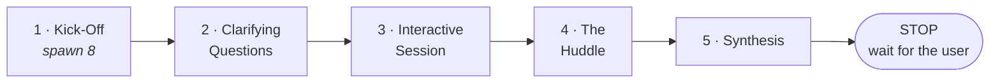
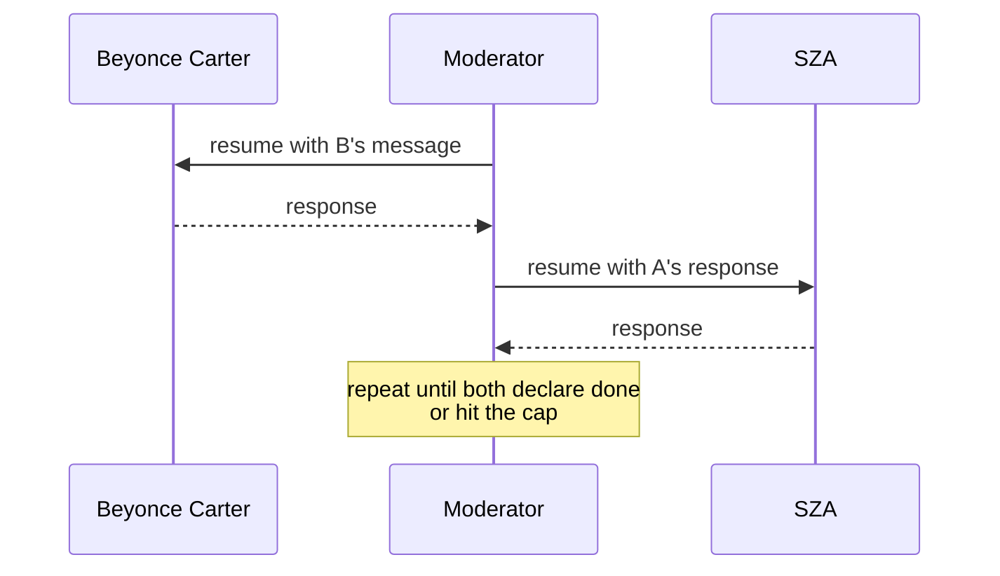

# Workflow

Five phases, in order, each blocked by the one before it.



The state file and the task list are updated together on every transition. The skill is explicit: never
one without the other.

## Before Phase 1: preparation

Two things happen before any agent is spawned.

**Dynamic assignment.** The moderator reads the content, decides its dominant technical domain, and
assigns Whitney Houston-Davis a PhD specialty and ChaoticCarl a backstory. Both are recorded in the state
file.

**Packet provenance.** When the content is a code change, the packet must be built from local working
state with `git diff <base>...HEAD`, never from `gh pr diff`, which reflects only pushed commits. The
content file must open with:

```
## Packet provenance
- Command: <exact command used to generate the diff>
- HEAD SHA: <sha>
- Base: <base ref and sha>
- Unpushed commits at packet time: <count, or "none">
- Working tree: <clean | list of dirty paths>
- Generated: <YYYY-MM-DD HH:MM local>
```

The moderator refuses to start Kick-Off without this header. The rule exists because a real review was
launched against a diff missing two local commits while the context notes described them as landed. Seven
of eight panelists caught it by reading the repository directly, and the review had to be rewound.

---

## Phase 1: Kick-Off

`kick-off` · eight agents spawned in parallel

The moderator presents the material cold. Full conversation context is deliberately withheld, so the
panel's reactions are not anchored to whatever you and Claude already concluded.

Each persona is asked to verify the packet before producing any findings:

> Phase 1 (Kick-Off), Step 0 (do this BEFORE any findings): the packet above may be stale. Pick 3
> specific claims the context notes make about the current state and verify each one against the actual
> repository with Read or Grep. If the packet and the repository disagree, report it as PROCESS FLAG at
> the very top of your response... the packet is the thing most likely to be wrong.

Then the actual ask:

> Provide your initial impressions and reactions from your professional perspective. Note **5-7 specific
> observations**, concerns, or areas you want to explore further. Reference exact fields, values, or
> details from the content.

**ChaoticCarl gets a different prompt entirely.** He receives a user-facing description instead of code,
context translated out of technical language, and a request for complaints rather than observations. He
has no repository access and cannot perform Step 0.

The moderator answers nothing here. She confirms receipt only: *"Noted, [Name]. We'll address that."*

---

## Phase 2: Clarifying Questions

`clarifying-questions` · eight agents resumed

Each persona asks 5&ndash;7 precise questions from its own lens. The moderator answers using the context
notes, the source material, and by reading the actual code.

She is required to admit **"not documented"** or **"untested"** where the gap is real, rather than
inventing coverage. ChaoticCarl's complaints get translated into their technical root cause, but his
original wording is preserved, a rule that carries all the way through to the Synthesis.

This is the phase where a review either becomes grounded or drifts.

---

## Phase 3: Interactive Session

`interactive-session` · moderator versus agent · cap 3 exchanges per agent

The maximum-adversarial fact-check. The moderator's job here is explicitly **not** to collect opinions but
to try to falsify each one.

> Phase 3 (Interactive Session): Based on these answers:
> 1. Challenge any answers that don't fully address your concerns
> 2. Provide specific recommendations
> 3. Push back on any claims you believe are incorrect or insufficiently supported
> 4. State any standards or requirements you'd want documented
>
> State your final stance explicitly: either **"I am satisfied"** (zero open items) or a list of your
> remaining open items.

### The shape is mandatory

This phase produces exactly **2N blocks for N personas**: one persona block and one moderator block, in
that order, for every persona. Eight personas means sixteen blocks. A persona who says "I am satisfied"
still gets a moderator response naming what was verified. ChaoticCarl is included and is never skipped.

Before printing the phase, the moderator counts her own blocks. If the count does not equal the number of
personas, she has skipped someone and goes back. An unanswered claim is an unverified claim, and an
unverified claim must not reach Synthesis.

### Required outputs

Three artifacts close the phase.

**Blocker Re-Test Ledger.** Confirming a structural fact is not enough to carry it as a Blocker. The
moderator must try to disprove that the fact actually causes the claimed harm, checking the surrounding
call path, guards, and any compensating step. Every Blocker reaching Synthesis needs a row:

| Blocker | Raised by | Attack attempted | Outcome |
|---|---|---|---|
| ... | ... | what would disprove it | Survived / Downgraded / Refuted |

**Consensus Ledger.** Printed whether or not there were disagreements. If none, it says so explicitly.
Never printed as nothing.

**Self-check.** Under the exact header `**Self-check before The Huddle**:`, the moderator answers
publicly: *"Did I reject any claim from any agent in this review? If not, why not?"* A zero-rejection
review must state whether that indicates insufficient rigor. The check works by making the absence of
skepticism visible rather than by demanding skepticism.

Plus an exchange-count line listing all eight personas, so cap compliance is visible.

---

## Phase 4: The Huddle

`the-huddle` · agent versus agent · cap 4 messages sent per agent; mandatory replies do not count

The moderator steps back and lets the experts engage directly, like grand rounds. Where Phase 3 tested
each claim against evidence, the Huddle tests it against the other experts' judgment.

### Subagents cannot talk to each other

There is no channel between two `Task` agents, so the debate is relayed. The moderator becomes a message
bus:



Every exchange costs two agent resumptions, which is why the moderator seeds a handful of high-friction
pairings rather than letting all eight talk freely.

### Seeding

Before relaying anything, the moderator identifies three to five unresolved cross-persona tensions and
seeds them deliberately, prioritizing pairs whose concerns overlap but do not align:

- Architecture versus research: Beyonce Carter and Whitney Houston-Davis
- Security versus compliance implementation: SZA and Doechii
- Operational requirements versus infrastructure proposals: Janelle Monae Robinson and Whitney Houston-Davis
- User impact versus technical root cause: ChaoticCarl and any technical persona

### Rules

- Agents recognize each other's expertise but never hesitate to push back on claims.
- **ChaoticCarl demands "explain like I'm five" from every expert.** If an expert cannot explain their
  concern simply, he says so loudly.
- The moderator intervenes only for three reasons: the conversation is circular, someone is being
  steamrolled, or ChaoticCarl is being ignored. She calls "last word" when exchanges plateau.

### Mandatory participation

Anyone who left Phase 3 with open items, conditions, or blockers **must** participate in at least one
exchange. Satisfied agents may sit out. The phase closes with a checklist naming who participated, and
anyone with unresolved concerns who did not is marked `[GAP]` with an explanation owed.

---

## Phase 5: Synthesis

`synthesis` · moderator alone

Ten required sections, deduplicated across personas, ordered by severity. A section with nothing in it
still prints its header with "None identified", so silence never looks like absence of a category.

| Section | Contents |
|---|---|
| **Verdict Scoreboard** | All eight personas by ready yes/no, blocker, warning, and suggestion counts |
| **Production Gates** | Blockers identified independently by two or more personas |
| **Compliance Findings** | Doechii only, each with a regulation citation and remediation |
| **Domain Expert Warnings** | Whitney Houston-Davis only, each with the cited principle |
| **User Experience Failures** | ChaoticCarl's complaint verbatim -> technical root cause -> recommended fix |
| **Mandatory Production Standards** | Operational requirements, attributed |
| **Improvements** | Improvement, source persona, severity |
| **Unresolved Disagreements** | Carried from the Consensus Ledgers |
| **Key Insight** | Exactly one finding, the most important across all reviewers |
| **Action Items** | Deduplicated, severity-ordered, each tagged and attributed |

**ChaoticCarl's counts are derived, not self-assigned.** The moderator maps each of his complaints to its
accepted root cause: a complaint tracing to an accepted Blocker counts as a Blocker on his row. His row is
never left blank, or the Overall line undercounts end-user impact.

### Then it stops

The skill ends with a literal `STOP`, repeated twice in the file. Present the synthesis. Change nothing.
Wait for the user to pick which action items to pursue.

---

## After the review

1. The transcript is written to `moe_section_<N>_review_transcript.md`.
2. `validate-moe-transcript.sh` runs, and its full output is printed verbatim and saved.
3. A background agent scores the run on six dimensions and writes `plugin-improvements.md`.

Failing checks are never resolved by editing the transcript. See
[Architecture](architecture.md#self-validation).
