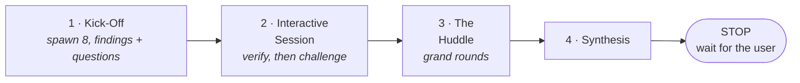
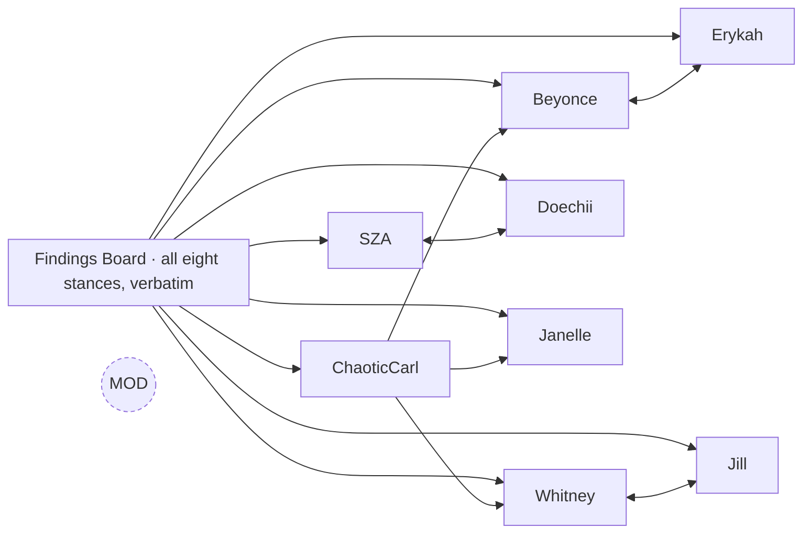

# Workflow

Four phases, in order, each blocked by the one before it.



## Who does what

Three roles. The session you are talking to holds only the first.

| Role | Who | Does |
|---|---|---|
| Observer | The main conversation | Spawns the moderator. Prints every phase block she sends, verbatim, as it arrives. After her hand-back, runs the validator and the quality-assessment agent. Makes no review decisions. |
| Moderator | Dr. Nina Simone-Bennett, a spawned agent | Builds the packet. Spawns the eight personas. Drives every phase. Verifies in Phase 2. Runs the Huddle's participation check and clock. Assembles the transcript and state file. |
| Panelists | The eight personas | Review, challenge, argue. |

The moderator sends each phase to the main session with `SendMessage` the moment it closes, so the
live thread reaches you even though the review is running in an agent you are not talking to.

The state file is updated on every transition. If `TaskCreate` is available to the moderator, the
task list is updated with it; if not, the state file alone is the record.

## Before Phase 1: preparation

Three things happen before any persona is spawned.

**Dynamic assignment.** The moderator reads the content, decides its dominant technical domain, and
assigns Whitney Houston-Davis a PhD specialty and ChaoticCarl a backstory. Both are recorded in the state
file.

**Packet provenance.** When the content is a code change, the packet must be built from local working
state with `git diff <base>...HEAD`, never from `gh pr diff`, which reflects only pushed commits. The
content file must open with:

```
## Packet provenance
- Command: <exact command used to generate the diff>
- HEAD SHA: <sha>
- Base: <base ref and sha>
- Unpushed commits at packet time: <count, or "none">
- Working tree: <clean | list of dirty paths>
- Generated: <YYYY-MM-DD HH:MM local>
- Verification performed: <method; engines; states exercised>
- Not verified: <what that method could not observe>
```

The moderator refuses to start Kick-Off without this header. The provenance lines exist because a real
review was launched against a diff missing two local commits, and seven of eight panelists caught it by
reading the repository directly. The two verification lines exist because a later review spent a full
round asking "did you test hover?", "which browser?", "which theme at 420px?", all of which belong in the
packet rather than in a question.

---

## Phase 1: Kick-Off

`kick-off` · eight personas spawned in parallel by the moderator

The moderator presents the material cold. Full conversation context is deliberately withheld, so the
panel's reactions are not anchored to whatever you and Claude already concluded. No persona sees another
persona's response.

Each persona is asked to verify the packet before producing any findings:

> Phase 1 (Kick-Off), Step 0 (do this BEFORE any findings): the packet above may be stale. Pick 3
> specific claims the context notes make about the current state and verify each one against the actual
> repository with Read or Grep. If the packet and the repository disagree, report it as PROCESS FLAG at
> the very top of your response... the packet is the thing most likely to be wrong.

Then the actual ask:

> Provide your initial impressions and reactions from your professional perspective. Note **5-7 specific
> observations**, concerns, or areas you want to explore further. Reference exact fields, values, or
> details from the content.
>
> End with up to 3 questions you need answered to complete your assessment, each on its own line
> beginning `Q:`. The moderator answers them at the start of Phase 2. "Not documented" is a legitimate
> answer you may receive.

**ChaoticCarl gets a different prompt entirely.** He receives a user-facing description instead of code,
context translated out of technical language, and a request for complaints rather than observations. He
has no repository access and cannot perform Step 0.

The moderator answers nothing here. She confirms receipt only: *"Noted, [Name]. We'll address that."*

---

## Phase 2: Interactive Session

`interactive-session` · moderator versus agent · cap 3 exchanges per agent

The maximum-adversarial fact-check. The moderator's job here is explicitly **not** to collect opinions but
to try to falsify each one.

### It opens with verification, not with a prompt

Before resuming anyone, the moderator verifies every finding each persona filed in Phase 1 against the
repository and answers every `Q:` line. Every verification and every answer uses one of four literal
openers, so a reader can count them:

- `I verified this:` with file:line evidence
- `I tested this:` with the command run and its raw output
- `I cannot verify this:` with what was checked and why it was inconclusive
- `This is incorrect:` with the contradicting evidence

"Not documented" and "not verifiable from source" are legitimate answers. Writing them is required;
inventing coverage is not permitted. For ChaoticCarl, each complaint is translated into its technical
root cause with his original wording preserved.

That verification is the moderator's opening block for each persona, and it is what the persona then
challenges:

> Phase 2 (Interactive Session): Based on this verification:
> 1. Challenge any verification or answer that does not fully address your concerns
> 2. Provide specific recommendations
> 3. Push back on any claims you believe are incorrect or insufficiently supported
> 4. State any standards or requirements you'd want documented
>
> State your final stance explicitly: either **"I am satisfied"** (zero open items) or a list of your
> remaining open items.

### The shape is mandatory

This phase produces exactly **3N blocks for N personas**, in this order for every persona: the
moderator's verification, the persona's challenge, the moderator's response. Eight personas means
twenty-four blocks. A persona who says "I am satisfied" still gets a moderator response naming what was
verified. ChaoticCarl is included and is never skipped.

Before printing the phase, the moderator counts her own blocks. If the count is not twice the number of
personas, she has skipped someone and goes back. An unanswered claim is an unverified claim, and an
unverified claim must not reach Synthesis.

### Required outputs

Three artifacts close the phase.

**Blocker Re-Test Ledger.** Confirming a structural fact is not enough to carry it as a Blocker. The
moderator must try to disprove that the fact actually causes the claimed harm, checking the surrounding
call path, guards, and any compensating step. Every Blocker reaching Synthesis needs a row:

| Blocker | Raised by | Attack attempted | Outcome |
|---|---|---|---|
| ... | ... | what would disprove it | Survived / Downgraded / Refuted |

**Consensus Ledger.** Printed whether or not there were disagreements. If none, it says so explicitly.
Never printed as nothing.

**Self-check.** Under the exact header `**Self-check before The Huddle**:`, the moderator answers
publicly: *"Did I reject any claim from any agent in this review? If not, why not?"* A zero-rejection
review must state whether that indicates insufficient rigor.

Plus an exchange-count line listing all eight personas, so cap compliance is visible.

---

## Phase 3: The Huddle

`the-huddle` · agent versus agent · grand rounds · cap 4 messages sent per agent; mandatory replies do not count

Where Phase 2 tested each claim against evidence, the Huddle tests it against the other experts'
judgment. The moderator is not in the message path. Personas write to each other directly with
`SendMessage`.

**Verification does not happen here.** If the moderator finds herself checking a number mid-Huddle, that
is Phase 2 work arriving late.

### The board

The moderator compiles the Findings Board: every persona's Phase 2 final stance, verbatim, all eight in
roster order, with severities and citations exactly as written. She adds nothing. No summary, no grouping,
no "note that X and Y disagree." If two personas filed opposite fixes for the same defect, both sit on the
board and the personas find it themselves.

Every persona, ChaoticCarl included, receives the whole board, the peer roster of agent IDs, and the same
rules block. Nobody is assigned a counterpart. Each one reads everything and chooses which findings to
answer and whom to write to.



Personas cannot discover each other: `ListAgents` is not available inside a subagent, so the roster the
moderator hands out is the only way anyone can address anyone.

### Rules every persona receives

- Send at least one message. Send at most four. A reply to someone who wrote to you does not count against
  the four and is mandatory unless they declared they were done.
- Address people by their full name from the roster. Never abbreviate.
- When you have nothing further for a counterpart, your final message to them ends with exactly:
  `I have nothing more to add.`
- Keep a verbatim log of every message sent and received, in `SENT ->` / `RECEIVED <-` form. The
  transcript is reconstructed from these logs and cross-checked against your counterparts' logs.

### What the moderator does: participation and the clock

Two jobs, and only two.

**Participation.** When every persona has gone idle, count who has sent at least one message. Being
written to and never answering is not participation. Anyone at zero gets exactly one nudge, and the nudge
names no finding, no counterpart and no topic. If a persona ignores it, that is recorded as a gap and there
is no second nudge. The check also asks: did anyone answer ChaoticCarl? If he wrote to someone who has not
replied, that reply obligation is enforced first.

**The clock.** At most two rounds. If round one leaves every message answered or closed, the Huddle is
over. If messages are unanswered or a thread is mid-exchange, round two opens: every persona receives the
round-one transcript, reconstructed verbatim from the logs, and may respond to anything in it. That is
how every panelist hears what every other panelist said. After round two, time is called regardless.
Anything still open goes to Synthesis as unresolved, with both positions stated.

### Closing: logs and the cross-check

The moderator asks every persona for its log and assembles the transcript from those, not from memory.
For every `SENT -> B` in A's log there must be a `RECEIVED <- A` in B's log with the same text, and the
reverse. A mismatch means a message was lost, a log was summarized, or an exchange was invented, and it is
stated in the participation checklist rather than quietly reconciled. On the first live run this check
caught a persona whose log omitted her own third message.

Every printed message is followed by a reply, by the sender's own closing declaration, or by a moderator
line stating that time was called. An unanswered message to or from ChaoticCarl is named as the failure
this phase exists to prevent.

The phase closes with a participation checklist built by counting printed blocks, with anyone at zero
after the nudge marked `[GAP]` and the reason written.

---

## Phase 4: Synthesis

`synthesis` · moderator alone

Ten required sections, deduplicated across personas, ordered by severity. A section with nothing in it
still prints its header with "None identified", so silence never looks like absence of a category.

| Section | Contents |
|---|---|
| **Verdict Scoreboard** | All eight personas by ready yes/no, blocker, warning, and suggestion counts |
| **Production Gates** | Blockers identified independently by two or more personas |
| **Compliance Findings** | Doechii only, each with a regulation citation and remediation |
| **Domain Expert Warnings** | Whitney Houston-Davis only, each with the cited principle |
| **User Experience Failures** | ChaoticCarl's complaint verbatim -> technical root cause -> recommended fix |
| **Mandatory Production Standards** | Operational requirements, attributed |
| **Improvements** | Improvement, source persona, severity |
| **Unresolved Disagreements** | Carried from the Consensus Ledgers |
| **Key Insight** | Exactly one finding, the most important across all reviewers |
| **Action Items** | Deduplicated, severity-ordered, each tagged and attributed |

**ChaoticCarl's counts are derived, not self-assigned.** The moderator maps each of his complaints to its
accepted root cause: a complaint tracing to an accepted Blocker counts as a Blocker on his row. His row is
never left blank, or the Overall line undercounts end-user impact.

### Then it stops

The skill ends with a literal `STOP`, repeated twice in the file. The moderator sends the Synthesis to
the main session and hands back with the transcript path. Nothing is changed. The user picks which action
items to pursue.

---

## After the review

The observer takes over.

1. The transcript is at `moe_section_<N>_review_transcript.md`, written by the moderator.
2. The observer runs `validate-moe-transcript.sh` and prints its full output verbatim, saving it alongside.
3. The observer spawns a background agent that scores the run on six dimensions and writes
   `plugin-improvements.md`.

Failing checks are never resolved by editing the transcript. See
[Architecture](architecture.md#self-validation).
